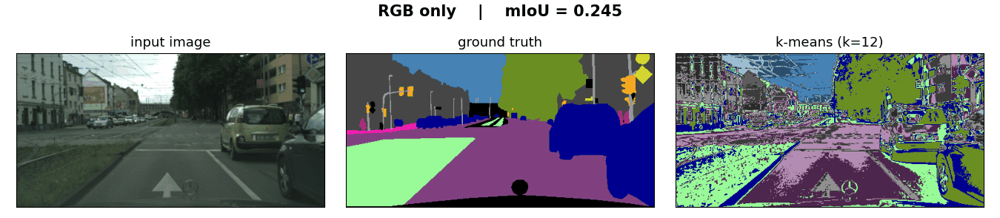
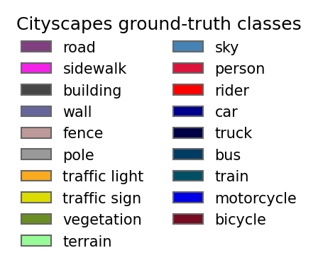
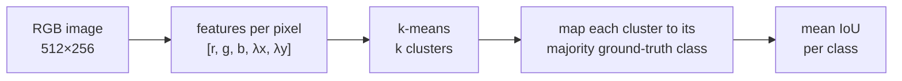
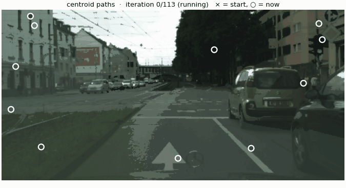
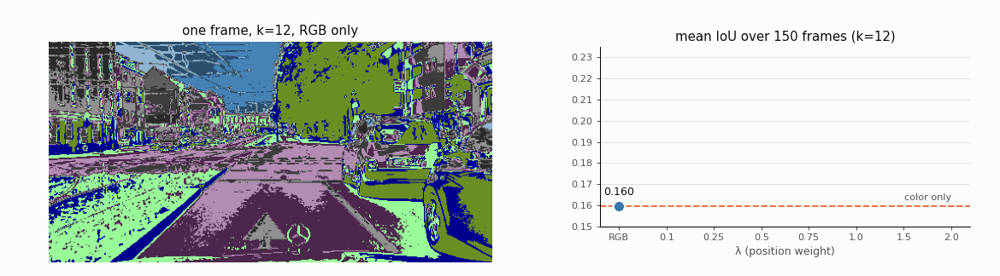
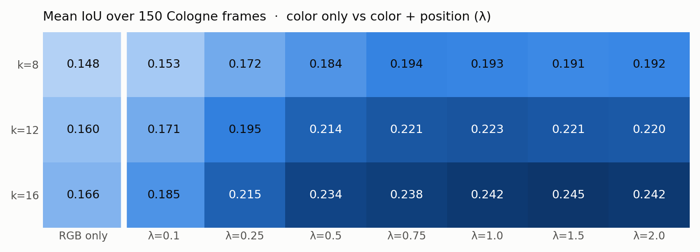
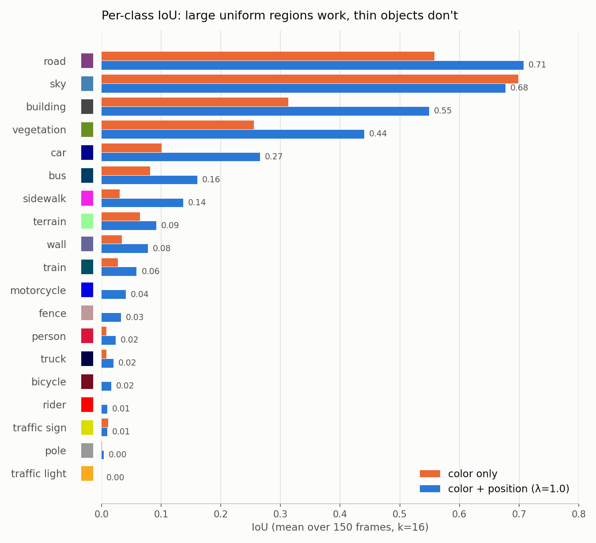
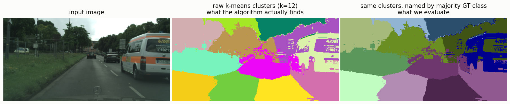
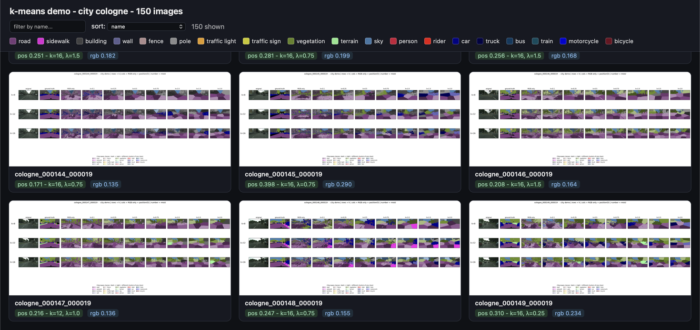
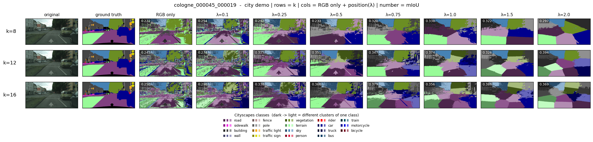

# Image Segmentation for Autonomous Vehicles Using K-Means Clustering

Image segmentation using the k-means algorithm on the [Cityscapes](https://www.cityscapes-dataset.com/) dataset.

## The idea in one GIF

K-means only groups pixels that look alike. With **color alone**, the same shade of gray ends up in one cluster whether it is road, wall or car, so the result is noisy speckle. Adding each pixel's **(x, y) position**, weighted by **λ**, pulls nearby pixels together and turns the speckle into compact regions.

<p align="center">
  
</p>

Segmentations are colored with the official Cityscapes class palette. When several clusters map to the same class, they are shown as darker and lighter shades of that class's color.

<p align="center">
  
</p>

## How it works



1. **Load** a frame and its fine ground-truth labels. Images are resized bilinearly, labels with nearest neighbor so no non-existent class IDs appear.
2. **Build features.** Every pixel becomes a vector

$$
\mathbf{f}(p) = \big[\, r,\ g,\ b,\ \lambda x,\ \lambda y \,\big], \qquad r, g, b, x, y \in [0, 1]
$$

   Color and coordinates are both normalized to `[0, 1]`, so neither dominates by scale alone. λ controls how much position matters: `λ = 0` is color only, a large λ favors spatially compact clusters (the same role *compactness* plays in SLIC superpixels).

3. **Cluster** with k-means (`MiniBatchKMeans`, `n_init=5`, fixed seed), which minimizes the within-cluster squared distance

$$
\min_{C_1,\dots,C_k} \sum_{j=1}^{k} \sum_{p \in C_j} \big\lVert \mathbf{f}(p) - \boldsymbol{\mu}_j \big\rVert^2
$$

4. **Name the clusters.** K-means returns anonymous cluster IDs, so each cluster is assigned the ground-truth class that covers most of its pixels (majority vote).
5. **Score** with mean IoU over the classes present in the frame, skipping the classes that the official Cityscapes evaluation ignores.

The clustering itself never sees a label. Ground truth is used only in steps 4–5, to name clusters and measure them.

<p align="center">
  <br>
  <sub>Lloyd's algorithm step by step (k=12, λ=1.0): each pixel is painted with its centroid's color, white lines trace where each centroid traveled. This animation uses plain random initialization to make the movement visible; the experiments use scikit-learn's k-means++ initialization, which converges much faster.</sub>
</p>

## Results

All numbers are the mean over **150 frames** from the city of Cologne (train split), at 512×256.

<p align="center">
  
</p>

| k | color only | best color + position | gain |
|:-:|:-:|:-:|:-:|
| 8  | 0.148 | 0.194 (λ=0.75) | +31% |
| 12 | 0.160 | 0.223 (λ=1.0)  | +39% |
| 16 | 0.166 | **0.245** (λ=1.5) | **+48%** |

Adding position helps for every k, and more clusters help too. The full sweep:

<p align="center">
  
</p>

### What k-means gets right, and what it misses

<p align="center">
  
</p>

- **Large, uniform regions work well:** road (0.71), sky (0.68), building (0.55), vegetation (0.44).
- **Thin and small objects are practically invisible:** poles, traffic lights, traffic signs and riders stay near 0. They are too small to win a majority vote in any cluster.
- **Sky is the one class that loses with position** (0.70 → 0.68). It is already uniform in color, and position forces k-means to split it into pieces. λ is a trade-off, not a free improvement.

### Clusters are appearance, not meaning

<p align="center">
  
</p>

What k-means actually returns is the middle panel: 12 anonymous blobs. It has no idea that one blob is a car and another is a road. The readable result on the right only appears after each cluster is named using the ground truth. K-means groups pixels by how they look, not by what they are.

## Limitations

- **No semantics.** The method groups appearance, so different classes with similar color (dark asphalt, dark cars, shadows) share clusters.
- **Spherical clusters.** K-means assumes roughly round clusters of similar size in feature space, which real object classes are not.
- **Oracle naming.** Cluster names come from the ground truth, so the scores measure how well clusters *align* with classes, not a standalone segmentation model.
- **Grid edge.** The best score sits at the largest k tested (k=16), so higher k might score higher still.
- **One city.** Evaluation covers 150 frames from Cologne only.

## Quick start

### 1. Install

```bash
git clone https://github.com/lukaszrudnik/cityscapes-segmentation-kmeans.git
cd cityscapes-segmentation-kmeans
python3 -m venv .venv && source .venv/bin/activate
pip install -r requirements.txt
```

### 2. Get the data

The [Cityscapes dataset](https://www.cityscapes-dataset.com/) requires a free registration. Download:

- `leftImg8bit_trainvaltest.zip` (images)
- `gtFine_trainvaltest.zip` (fine labels)

and extract both into `data/`:

```bash
unzip leftImg8bit_trainvaltest.zip -d data/
unzip gtFine_trainvaltest.zip -d data/
```

<details>
<summary>Expected layout</summary>

```
data/
  leftImg8bit/
    train/
      cologne/
        cologne_000000_000019_leftImg8bit.png
        ...
  gtFine/
    train/
      cologne/
        cologne_000000_000019_gtFine_labelIds.png
        ...
```

</details>

### 3. Run

**Notebook: the full analysis**

```bash
jupyter notebook notebook.ipynb
```

Run the cells in order. All parameters (city, number of frames, k, λ, resolution) live in the `CONFIG` cell. The segmentation sweep runs 150 frames × 3 values of k × 8 variants = 3,600 k-means fits, so it takes a while. Set `num_images` to a small number for a quick test run.

**Demo gallery: browse every frame**

```bash
python generate_demo.py
```

Renders one figure per frame (every k × every λ) into `results/demo/` and builds an interactive HTML gallery of all of them. Parameters are in the `CONFIG` dictionary at the bottom of the script. Like the notebook, a full run over 150 frames runs 3,600 k-means fits and renders 150 figures, so it takes a while. Lower `num_images` for a quick try.

Open the gallery in any browser, no server needed:

```bash
open results/demo/index.html        # macOS
xdg-open results/demo/index.html    # Linux
```

- a tile for every frame, with its best color + position mIoU (and the k, λ that achieved it) next to the color-only score
- **filter** frames by name and **sort** them by mIoU, best or worst first, to find where k-means shines and where it fails
- click any tile to open the full-size figure
- Cityscapes color legend always visible at the top

<p align="center">
  
</p>

Each frame gets a figure like this one (rows = k, columns = color only and every λ, number in the corner = mIoU):

<p align="center">
  
</p>

## Presentation

The project presentation is available in [Polish](presentation_pl.pdf).

## Authors

**Łukasz Rudnik** and **Mikołaj Suchan**<br>
*Mathematical Foundations of Artificial Intelligence*, Jagiellonian University, 2025/2026
